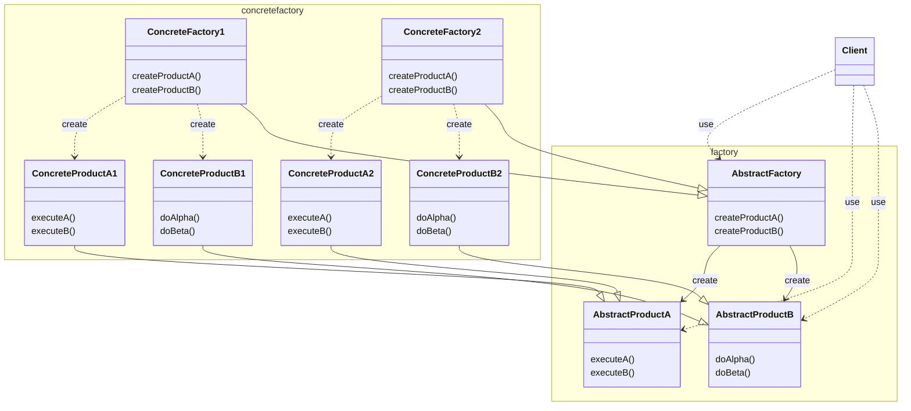

## Abstract Factory

https://refactoring.guru/ja/design-patterns/abstract-factory

```mermaid
classDiagram
  class Client

  namespace factory {
    class AbstractProductA {
      executeA()
      executeB()
    }
    class AbstractProductB {
      doAlpha()
      doBeta()
    }
    class AbstractFactory {
      createProductA()
      createProductB()
    }
  }
  namespace concretefactory {
    class ConcreteFactory1 {
      createProductA()
      createProductB()
    }
    class ConcreteProductA1 {
      executeA()
      executeB()
    }
    class ConcreteProductB1 {
      doAlpha()
      doBeta()
    }
    class ConcreteFactory2 {
      createProductA()
      createProductB()
    }
    class ConcreteProductA2 {
      executeA()
      executeB()
    }
    class ConcreteProductB2 {
      doAlpha()
      doBeta()
    }
  }

  Client ..> AbstractFactory: use
  Client ..> AbstractProductA: use
  Client ..> AbstractProductB: use

  AbstractFactory --> AbstractProductA: create
  AbstractFactory --> AbstractProductB: create

  ConcreteFactory1 ..> ConcreteProductA1: create
  ConcreteFactory1 ..> ConcreteProductB1: create
  ConcreteFactory2 ..> ConcreteProductA2: create
  ConcreteFactory2 ..> ConcreteProductB2: create

  ConcreteFactory1 --|> AbstractFactory
  ConcreteFactory2 --|> AbstractFactory
  ConcreteProductA1 --|> AbstractProductA
  ConcreteProductA2 --|> AbstractProductA
  ConcreteProductB1 --|> AbstractProductB
  ConcreteProductB2 --|> AbstractProductB
```
