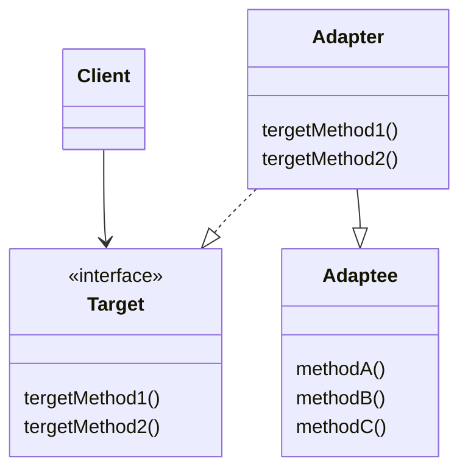
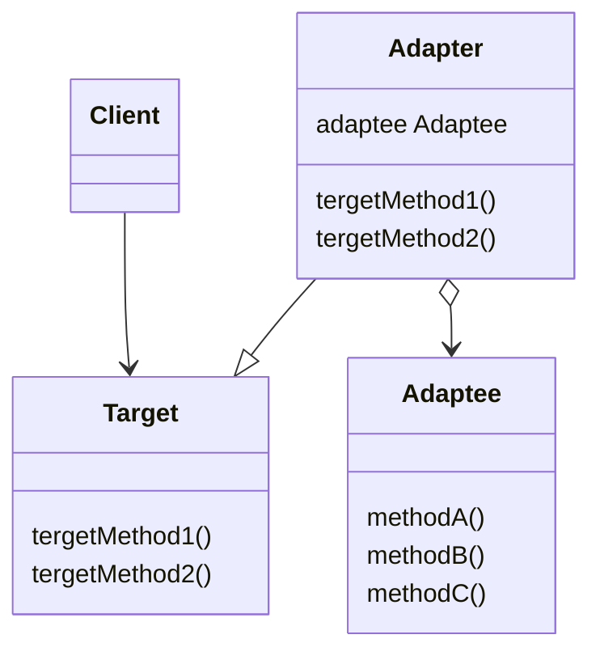

## Adapter

https://refactoring.guru/ja/design-patterns/adapter

### 継承を利用したAdapter

```mermaid
classDiagram
  class Client {
  }
  class Target {
    <<interface>>
    tergetMethod1()
    tergetMethod2()
  }
  class Adapter {
    tergetMethod1()
    tergetMethod2()
  }
  class Adaptee {
    methodA()
    methodB()
    methodC()
  }

  Client --> Target
  Adapter ..|> Target
  Adapter --|> Adaptee
```

### 委譲を利用したAdapter

```mermaid
classDiagram
  class Client {
  }
  class Target {
    tergetMethod1()
    tergetMethod2()
  }
  class Adapter {
    adaptee Adaptee
    tergetMethod1()
    tergetMethod2()
  }
  class Adaptee {
    methodA()
    methodB()
    methodC()
  }

  Client --> Target
  Adapter --|> Target
  Adapter o--> Adaptee
```
