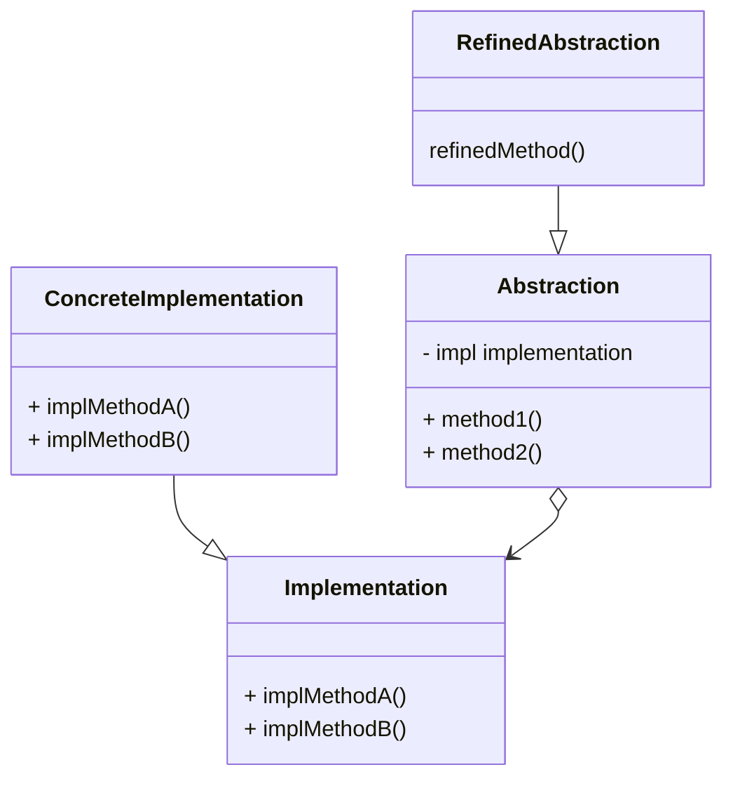

## Bridge

https://refactoring.guru/ja/design-patterns/bridge

```mermaid
classDiagram
  class Abstraction {
    - impl implementation
    + method1()
    + method2()
  }
  class RefinedAbstraction {
    refinedMethod()
  }
  class Implementation {
    + implMethodA()
    + implMethodB()
  }
  class ConcreteImplementation {
    + implMethodA()
    + implMethodB()
  }

  RefinedAbstraction --|> Abstraction
  ConcreteImplementation --|> Implementation
  Abstraction o--> Implementation
```
