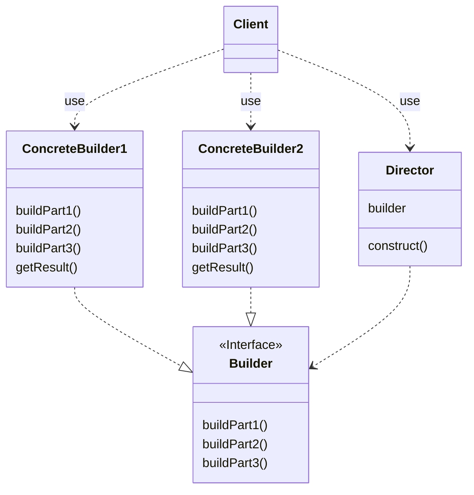

## Builder

https://refactoring.guru/ja/design-patterns/builder

```mermaid
classDiagram
  class Client

  class Director {
    builder
    construct()
  }

  class Builder {
    <<Interface>>
    buildPart1()
    buildPart2()
    buildPart3()
  }

  class ConcreteBuilder1 {
    buildPart1()
    buildPart2()
    buildPart3()
    getResult()
  }

  class ConcreteBuilder2 {
    buildPart1()
    buildPart2()
    buildPart3()
    getResult()
  }

  ConcreteBuilder1 ..|> Builder
  ConcreteBuilder2 ..|> Builder

  Director ..> Builder

  Client ..> Director: use
  Client ..> ConcreteBuilder1: use
  Client ..> ConcreteBuilder2: use
```
