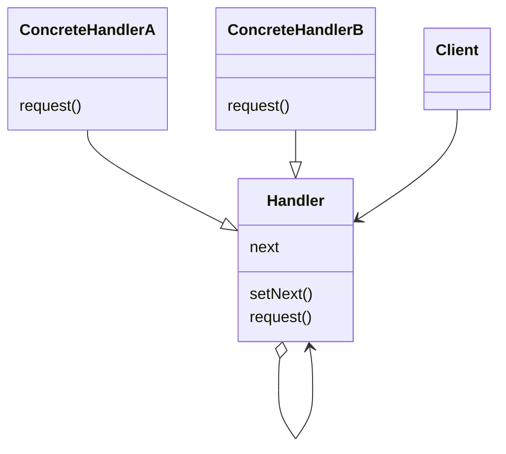

## Chain of Responsibility

https://refactoring.guru/ja/design-patterns/chain-of-responsibility

```mermaid
classDiagram
  class Handler {
    next
    setNext()
    request()
  }
  class ConcreteHandlerA {
    request()
  }
  class ConcreteHandlerB {
    request()
  }
  class Client

  Handler o--> Handler
  ConcreteHandlerA --|> Handler
  ConcreteHandlerB --|> Handler
  Client --> Handler
```
