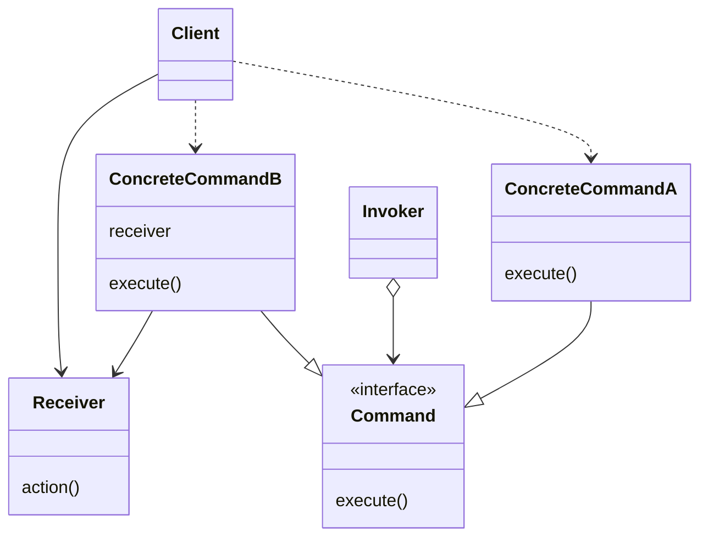

## Command

https://refactoring.guru/ja/design-patterns/command

```mermaid
classDiagram
  class Command {
    <<interface>>
    execute()
  }
  class ConcreteCommandA {
    execute()
  }
  class ConcreteCommandB {
    receiver
    execute()
  }
  class Invoker {
  }
  class Receiver {
    action()
  }
  class Client

  ConcreteCommandA --|> Command
  ConcreteCommandB --|> Command
  ConcreteCommandB --> Receiver
  Invoker o--> Command
  Client ..> ConcreteCommandA
  Client ..> ConcreteCommandB
  Client --> Receiver
```
