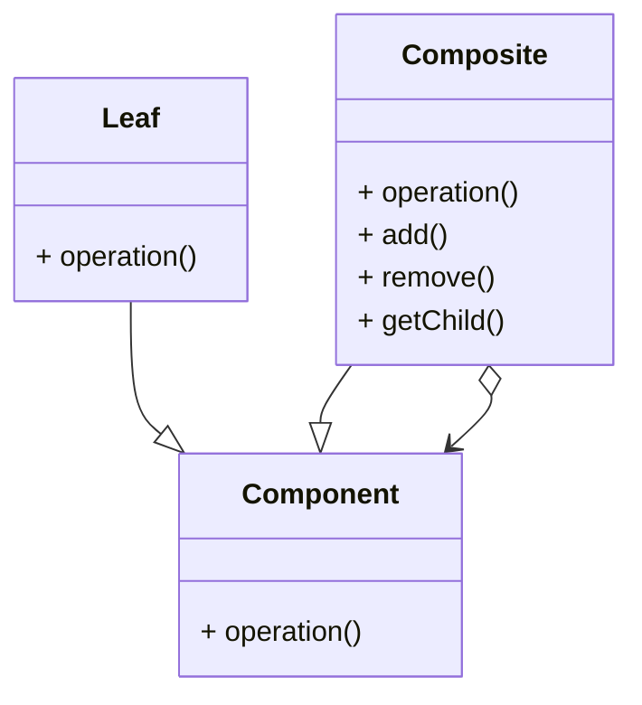

## Composite

https://refactoring.guru/ja/design-patterns/composite

```mermaid
classDiagram
  class Component {
    + operation()
  }
  class Leaf {
    + operation()
  }
  class Composite {
    + operation()
    + add()
    + remove()
    + getChild()
  }

  Leaf --|> Component
  Composite --|> Component
  Composite o--> Component
```
