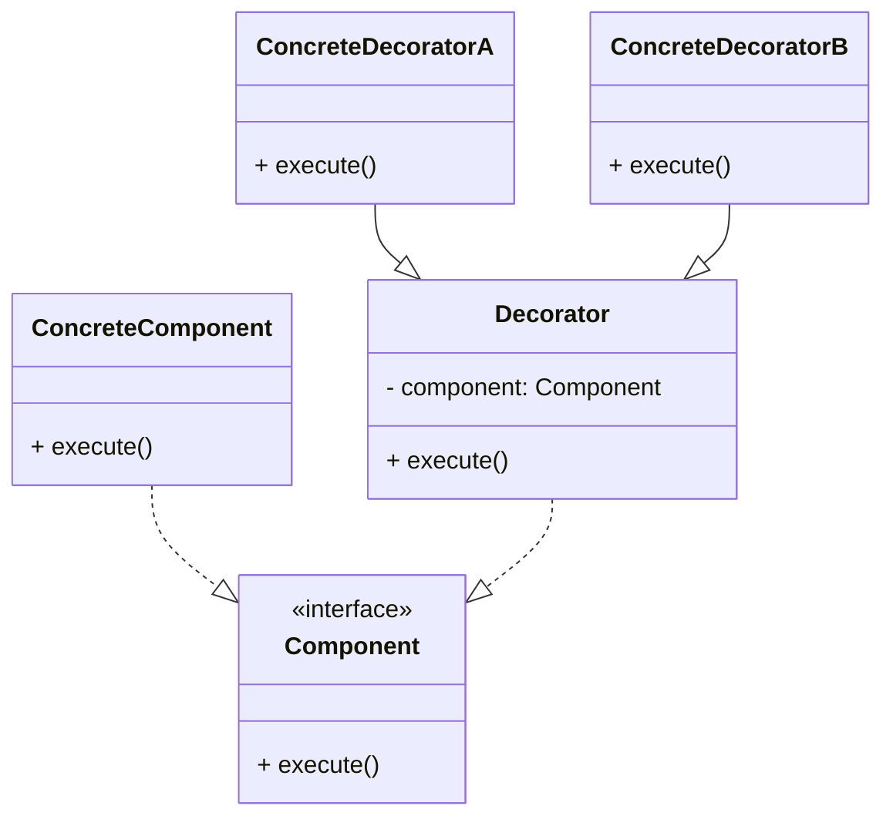

## Decorator

https://refactoring.guru/ja/design-patterns/decorator

```mermaid
classDiagram
  class Component {
    <<interface>>
    + execute()
  }
  class ConcreteComponent {
    + execute()
  }
  class Decorator {
    - component: Component
    + execute()
  }
  class ConcreteDecoratorA {
    + execute()
  }
  class ConcreteDecoratorB {
    + execute()
  }

  ConcreteComponent ..|> Component
  Decorator ..|> Component
  ConcreteDecoratorA --|> Decorator
  ConcreteDecoratorB --|> Decorator
```
