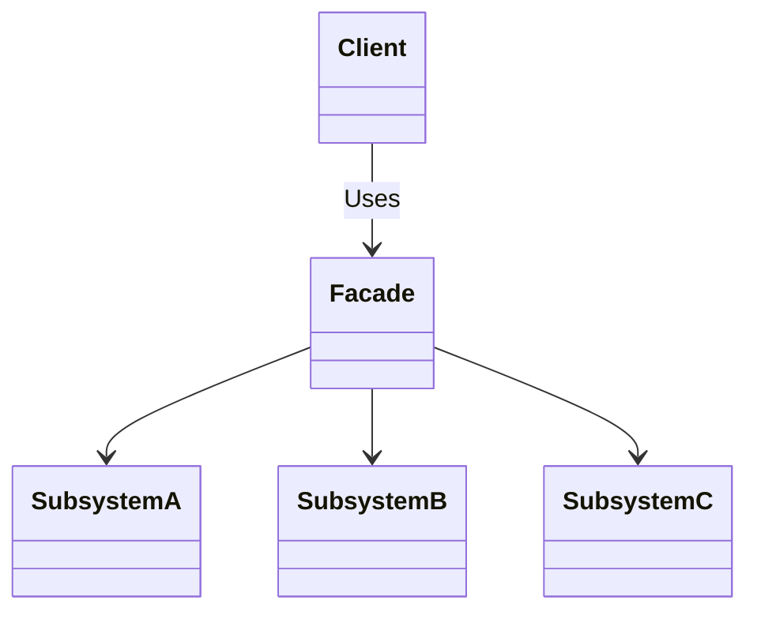

## Facade

https://refactoring.guru/ja/design-patterns/facade

```mermaid
classDiagram
  class Client
  class Facade
  class SubsystemA
  class SubsystemB
  class SubsystemC

  Client --> Facade: Uses
  Facade --> SubsystemA
  Facade --> SubsystemB
  Facade --> SubsystemC
```
