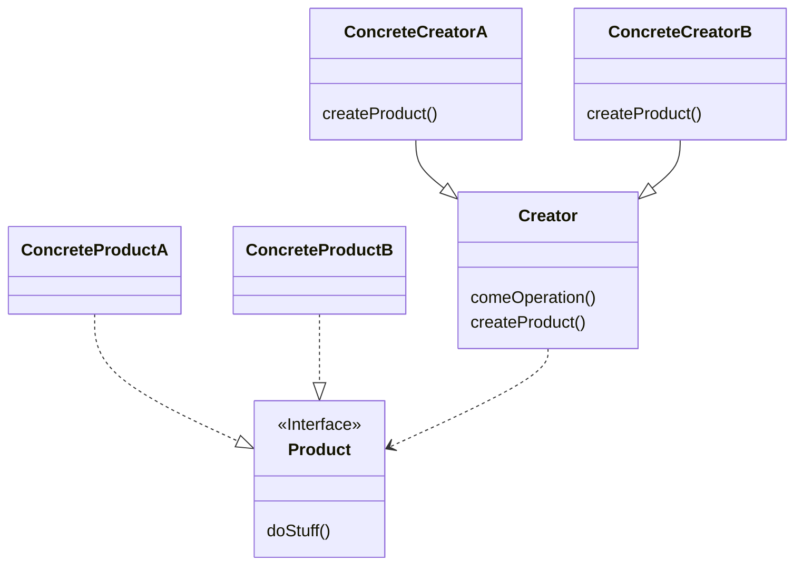

## Factory Method

https://refactoring.guru/ja/design-patterns/factory-method

```mermaid
classDiagram

  class Creator {
    comeOperation()
    createProduct()
  }
  class ConcreteCreatorA {
    createProduct()
  }
  class ConcreteCreatorB {
    createProduct()
  }
  class Product {
    <<Interface>>
    doStuff()
  }
  class ConcreteProductA {
  }
  class ConcreteProductB {
  }

  ConcreteCreatorA --|> Creator
  ConcreteCreatorB --|> Creator

  ConcreteProductA ..|> Product
  ConcreteProductB ..|> Product

  Creator ..> Product
```
