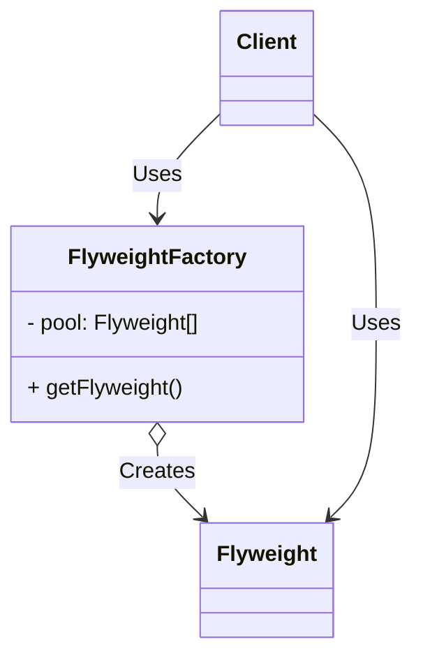

## Flyweight

https://refactoring.guru/ja/design-patterns/flyweight

```mermaid
classDiagram
  class Flyweight
  class FlyweightFactory {
    - pool: Flyweight[]
    + getFlyweight()
  }
  class Client

  FlyweightFactory o--> Flyweight: Creates
  Client --> FlyweightFactory: Uses
  Client --> Flyweight: Uses
```
