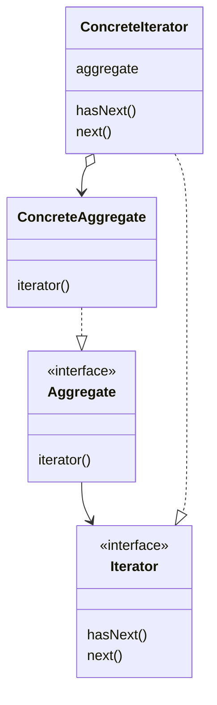

## Iterator

https://refactoring.guru/ja/design-patterns/iterator

```mermaid
classDiagram
  class Iterator {
    <<interface>>
    hasNext()
    next()
  }
  class Aggregate {
    <<interface>>
    iterator()
  }
  class ConcreteIterator {
    aggregate
    hasNext()
    next()
  }
  class ConcreteAggregate {
    iterator()
  }
  Aggregate --> Iterator
  ConcreteAggregate ..|> Aggregate
  ConcreteIterator ..|> Iterator
  ConcreteIterator o--> ConcreteAggregate
```
