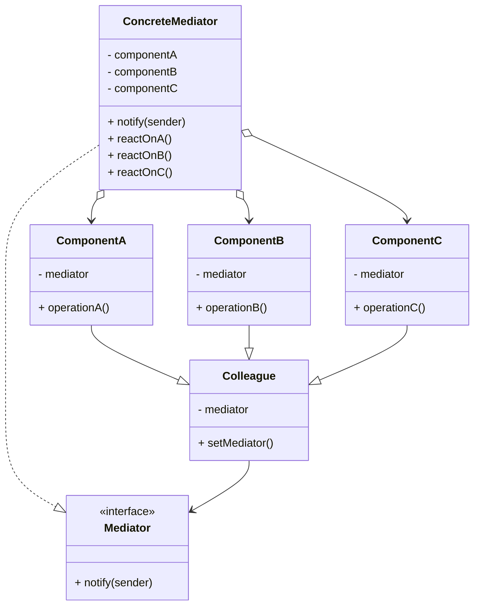

## Mediator

https://refactoring.guru/ja/design-patterns/mediator

```mermaid
classDiagram
  class Mediator {
    <<interface>>
    + notify(sender)
  }
  class ConcreteMediator {
    - componentA
    - componentB
    - componentC
    + notify(sender)
    + reactOnA()
    + reactOnB()
    + reactOnC()
  }
  class Colleague {
    - mediator
    + setMediator()
  }
  class ComponentA {
    - mediator
    + operationA()
  }
  class ComponentB {
    - mediator
    + operationB()
  }
  class ComponentC {
    - mediator
    + operationC()
  }
  ConcreteMediator ..|> Mediator
  ConcreteMediator o--> ComponentA
  ConcreteMediator o--> ComponentB
  ConcreteMediator o--> ComponentC
  ComponentA --|> Colleague
  ComponentB --|> Colleague
  ComponentC --|> Colleague
  Colleague --> Mediator
```
