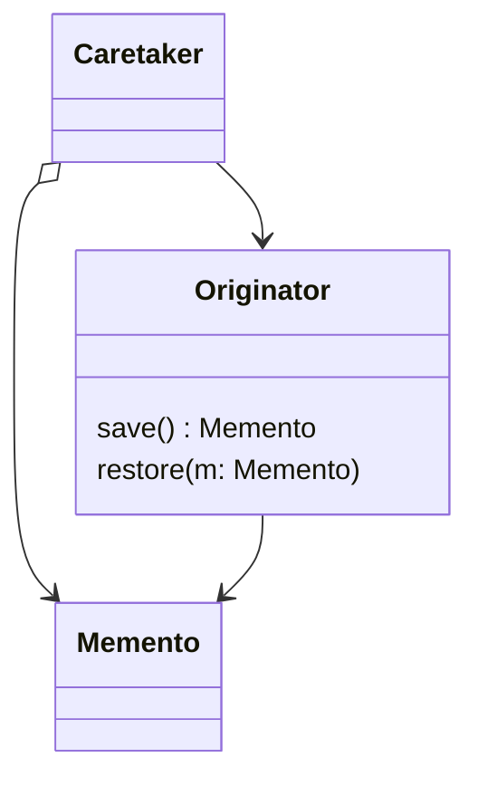
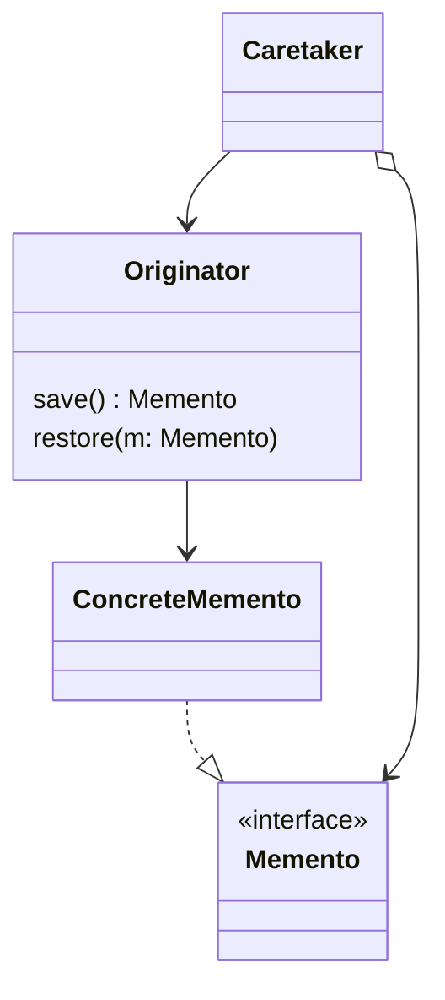

## Memento

https://refactoring.guru/ja/design-patterns/memento

### ネストされたクラスに基づく実装

```mermaid
classDiagram
  class Originator {
    save() Memento
    restore(m: Memento)
  }
  class Memento {
  }
  class Caretaker {
  }
  Caretaker o--> Memento
  Originator --> Memento
  Caretaker --> Originator
```

### クラスのネストをサポートしない言語に適した代替実装

```mermaid
classDiagram
  class Originator {
    save() Memento
    restore(m: Memento)
  }
  class Memento {
    <<interface>>
  }
  class ConcreteMemento {
  }
  class Caretaker {
  }
  ConcreteMemento ..|> Memento
  Caretaker o--> Memento
  Originator --> ConcreteMemento
  Caretaker --> Originator
```
