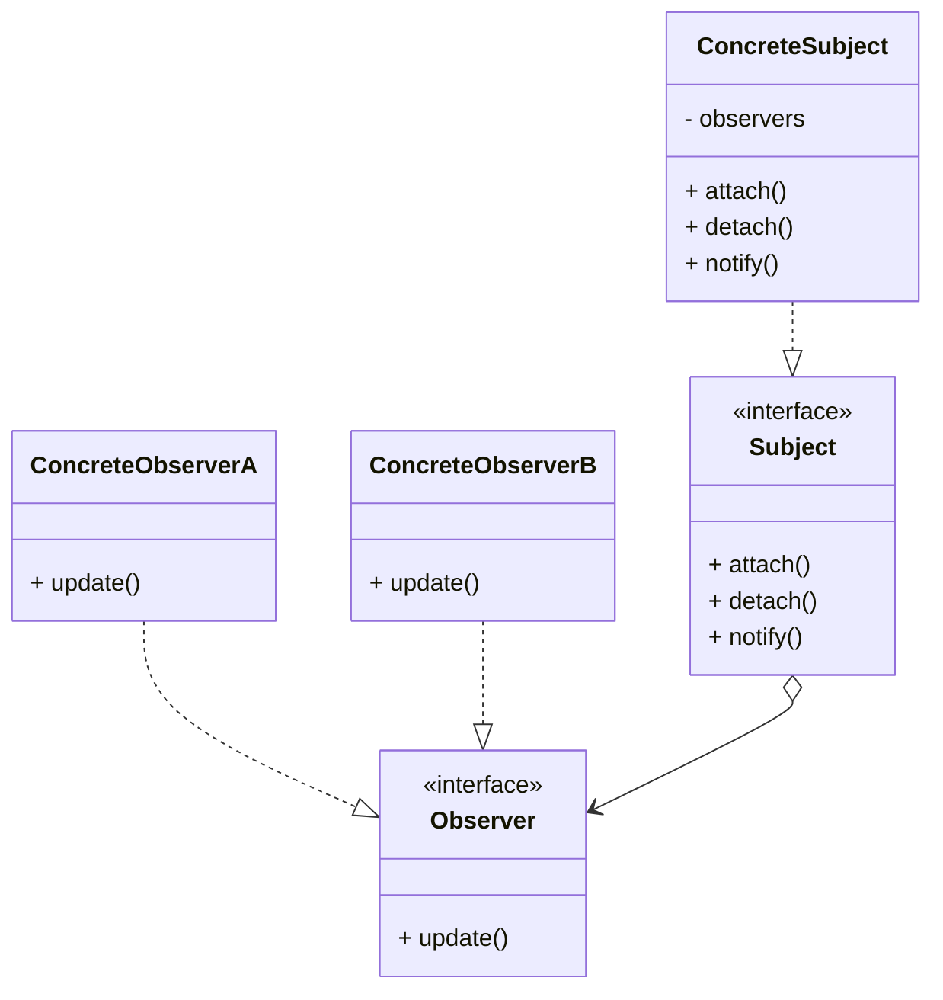

## Observer

https://refactoring.guru/ja/design-patterns/observer

```mermaid
classDiagram
  class Subject {
    <<interface>>
    + attach()
    + detach()
    + notify()
  }
  class ConcreteSubject {
    - observers
    + attach()
    + detach()
    + notify()
  }
  class Observer {
    <<interface>>
    + update()
  }
  class ConcreteObserverA {
    + update()
  }
  class ConcreteObserverB {
    + update()
  }

  ConcreteSubject ..|> Subject
  ConcreteObserverA ..|> Observer
  ConcreteObserverB ..|> Observer
  Subject o--> Observer
```
