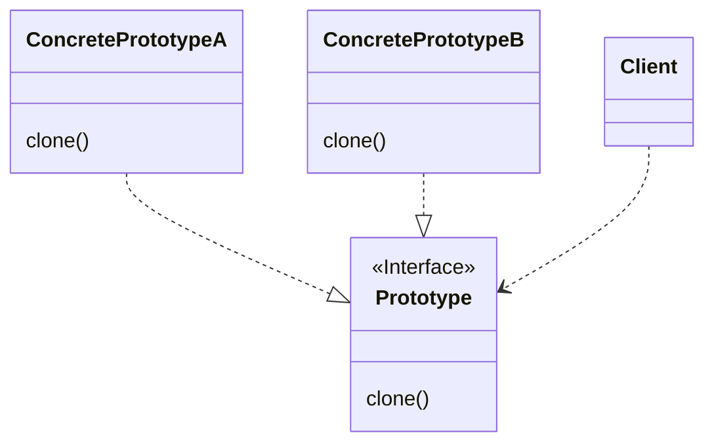

## Prototype

https://refactoring.guru/ja/design-patterns/prototype

```mermaid
classDiagram
  class Prototype {
    <<Interface>>
    clone()
  }
  class ConcretePrototypeA {
    clone()
  }
  class ConcretePrototypeB {
    clone()
  }
  class Client {
  }

  ConcretePrototypeA ..|> Prototype
  ConcretePrototypeB ..|> Prototype
  Client ..> Prototype
```
