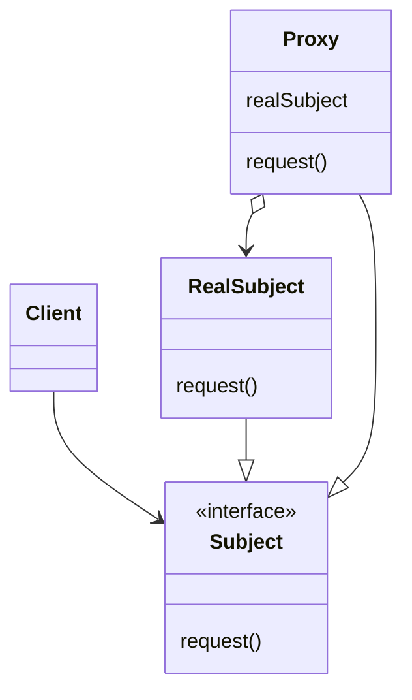

## Proxy

https://refactoring.guru/ja/design-patterns/proxy

```mermaid
classDiagram
  class Subject {
    <<interface>>
    request()
  }
  class RealSubject {
    request()
  }
  class Proxy {
    realSubject
    request()
  }
  class Client

  Client --> Subject
  RealSubject --|> Subject
  Proxy --|> Subject
  Proxy o--> RealSubject
```
