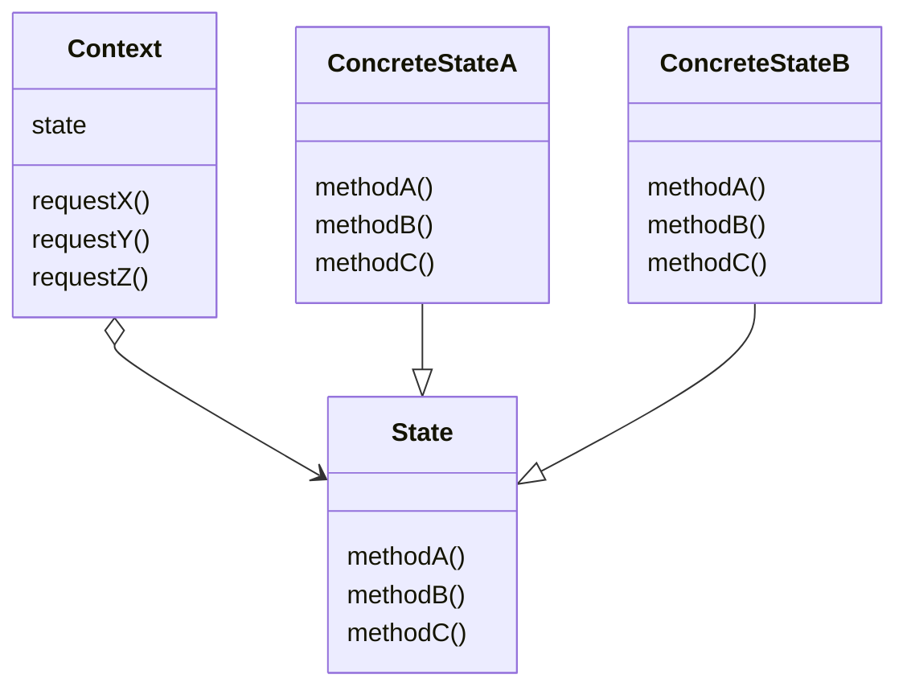

## State

https://refactoring.guru/ja/design-patterns/state

```mermaid
classDiagram
  class Context {
    state
    requestX()
    requestY()
    requestZ()
  }
  class State {
    methodA()
    methodB()
    methodC()
  }
  class ConcreteStateA {
    methodA()
    methodB()
    methodC()
  }
  class ConcreteStateB {
    methodA()
    methodB()
    methodC()
  }
  Context o--> State
  ConcreteStateA --|> State
  ConcreteStateB --|> State
```
