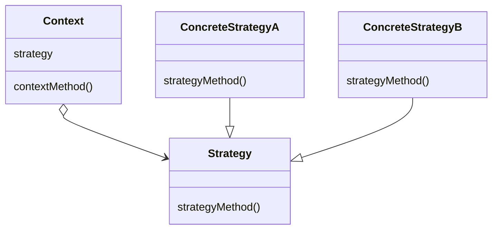

## Strategy

https://refactoring.guru/ja/design-patterns/strategy

```mermaid
classDiagram
  class Context {
    strategy
    contextMethod()
  }
  class Strategy {
    strategyMethod()
  }
  class ConcreteStrategyA {
    strategyMethod()
  }
  class ConcreteStrategyB {
    strategyMethod()
  }
  Context o--> Strategy
  ConcreteStrategyA --|> Strategy
  ConcreteStrategyB --|> Strategy
```
