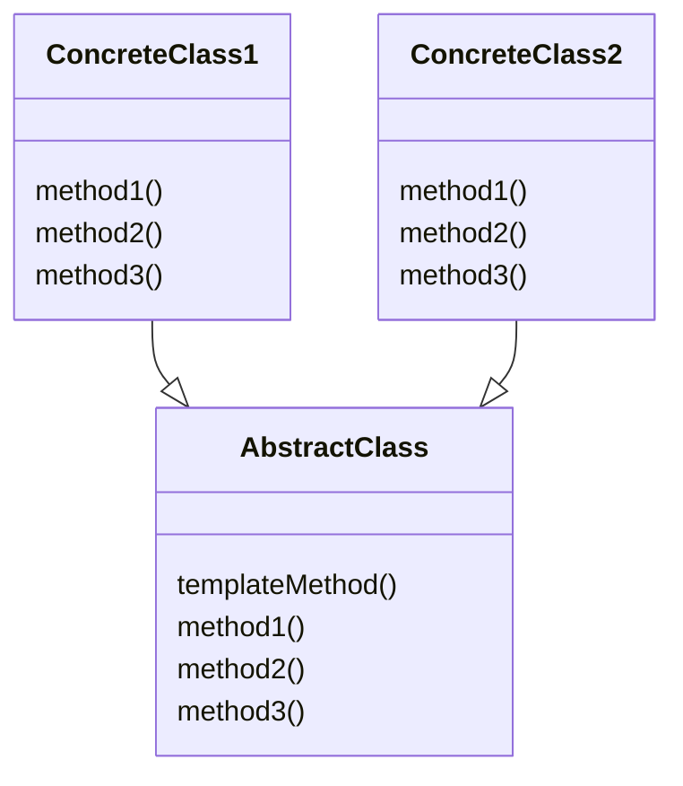

## Template Method

https://refactoring.guru/ja/design-patterns/template-method

```mermaid
classDiagram
  class AbstractClass {
    templateMethod()
    method1()
    method2()
    method3()
  }
  class ConcreteClass1 {
    method1()
    method2()
    method3()
  }
  class ConcreteClass2 {
    method1()
    method2()
    method3()
  }
  ConcreteClass1 --|> AbstractClass
  ConcreteClass2 --|> AbstractClass
```
